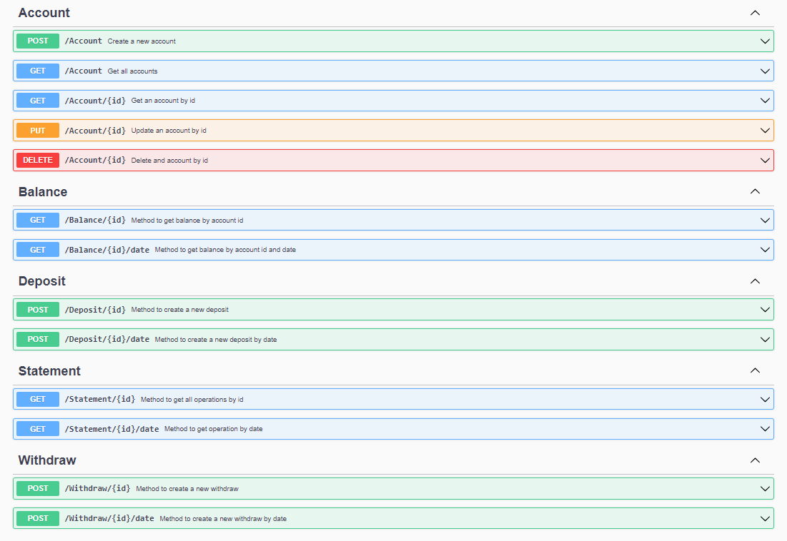

# FinanceApi

Api developed as a learning challenge with technologies, Net 6, C# and Mysql.

API's proposal was to be able to create a shopkeeper system where the customer could create an account, make deposits, withdraw, check balance, make future deposits and withdrawals and be able to check future balance.

# Endpoints

<p align="center">

</p>

# Description

A REST API with resources representing Account, Balance, Withdrawals, Deposits and Statement, developed in .Net 6.:

- [x] **.Net 6**;
- [x] **MySql Workbench**;
- [x] **Microsoft.EntityFrameworkCore** package;
- [x] **Microsoft.EntityFrameworkCore.Mysql** package;
- [x] **Pomelo.EntityFrameworkCore.MySql** package;
- [x] **Microsoft.EntityFrameworkCore.Proxies** package;
- [x] **Microsoft.EntityFrameworkCore.Tools** package;
- [x] **AutoMapper.Extensions.Microsoft.DependencyInjection** package;

# Table of Contents

1. **[Title](#financeapi "Title")**
2. **[Endpoints](#endpoints "Endpoints")**
3. **[Description](#description "Description")**
4. **[Table of Contents](#table-of-contents "Table of Contents")**
5. **[Installation](#installation "Installation")**

    1. **[Requirements](#requirements "Requirements")**
    2. **[Clone and Restore](#clone-and-restore "Clone and Restore")**
    3. **[Mysql Installation (Windows)](#mysql-installation-windows "Mysql Installation (Windows)")**
    4. **[Mysql in the project](#mysql-in-the-project "Mysql in the project")**

6. **[Usage](#usage "Usage")**
7. **[Contributing](#contributing "Contributing")**
8. **[Credits](#credits "Credits")**

# Installation

## Requirements:

This project require installation of some other tools. You need to have **[GIT](https://git-scm.com/downloads "git downloads")** to clone this repo, install **[.Net Core SDK](https://dotnet.microsoft.com/download "microsoft downloads")** to work with .net cross-platform development environment and use `dotnet cli` commands to restore the project and get all packages and dependencies needed properly installed, including **[EntityFrameworkCore](https://www.nuget.org/packages/Microsoft.EntityFrameworkCore/ "nuget gallery")** and **[Mysql](https://dev.mysql.com/downloads/workbench "mysql downloads")**. At last but not least, you will need **[Mysql](https://dev.mysql.com/downloads/workbench "mysql downloads")** installed on your system and run it before starting to run the project to create the tables..

## Clone and Restore

The restore command will provide installations for needed packages.

    $ dotnet restore Application

## Mysql Installation (Windows)

 - You can download it directly from **[Mysql](https://dev.mysql.com/downloads/workbench "mysql downloads")** official downloads page and follow the steps to install the executable;
 - If you need help installing, check out this **[practical guide](https://dicasdeprogramacao.com.br/como-instalar-o-mysql-no-windows/ "practical guide")**;

## Mysql in the project

Configure an entry for your settings in your `appsettings.json`. Following there is an example:

```json
{
  "ConnectionStrings": {
    "ConnectionAccount": "server=localhost;database=financeapi;user=root;password=root"
  }
}
```

To add Mysql to the project you need to register on your dependency injection services through the method `ConfigureServices` in the `Program.cs`.

You can do it in many ways. Following there is an example on how to do so:

Program.cs

```c#
string mySqlConnection =
builder.Configuration.GetConnectionString("ConnectionAccount");
builder.Services.AddDbContextPool<AccountDbContext>(opt =>
opt.UseLazyLoadingProxies().UseMySql(mySqlConnection, ServerVersion.AutoDetect(mySqlConnection)));
```

#  Usage

If you are using VS Code, configure your VS Code Debugger with _.vscode_ folder on your project root folder, pres `F5` and select `.Net 5+ and .NET Core` as your running target option. It will ask to create a build task, generating a file like following.

tasks.json:

```json

{
    "version": "2.0.0",
    "tasks": [
        {
            "label": "build",
            "command": "dotnet",
            "type": "process",
            "args": [
                "build",
                "${workspaceFolder}/FinanceApi/FinanceApi.csproj",
                "/property:GenerateFullPaths=true",
                "/consoleloggerparameters:NoSummary"
            ],
            "problemMatcher": "$msCompile"
        }
    ]
}
```

> Inside the project directory, run via terminal.

    $ dotnet run

# Contributing

Feel free to *Fork* this repo and send a *Pull Request* with your ideas and improvements, turning this proof of concept any better.

# Credits

This project was conceived by me, [@paulohenrique](https://github.com/PauloHenriqueJr "author's profile") : elmineirodev@gmail.com, then owner of this repository.
achine before running this install. 